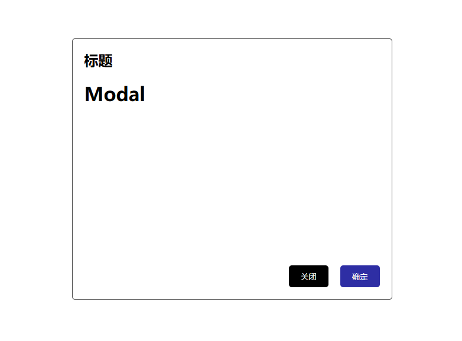

# createPortal

注意这是一个API，不是组件，他的作用是：将一个组件渲染到DOM的任意位置，跟Vue的Teleport组件类似。

## 用法

```tsx
import { createPortal } from 'react-dom';

const App = () => {
  return createPortal(<div>小满zs</div>, document.body);
};

export default App;
```

### 参数
入参

- children：要渲染的组件
- domNode：要渲染到的DOM位置
- key?：可选，用于唯一标识要渲染的组件

返回值

- 返回一个React元素(即jsx)，这个元素可以被React渲染到DOM的任意位置

## 应用场景

- 弹窗
- 下拉框
- 全局提示
- 全局遮罩
- 全局Loading

例如 Antd 的 Modal 组件，就是挂载到 body 上的。


## 案例

封装弹框组件

- src/components/Modal/index.tsx

```tsx
import './index.css';
export const Modal = () => {
  return <div className="modal">
    <div className="modal-header">
      <div className="modal-title">标题</div>
    </div>
    <div className="modal-content">
      <h1>Modal</h1>
    </div>
    <div className="modal-footer">
      <button className="modal-close-button">关闭</button>
      <button className="modal-confirm-button">确定</button>
    </div>
  </div>
}
```
- src/components/Modal/index.css

```css
.modal {
    position: absolute;
    top: 0;
    left: 0;
    width: 100%;
    height: 100%;
    border: 1px solid #4d4d4d;
    width: 500px;
    height: 400px;
    left: 50%;
    top: 50%;
    transform: translate(-50%, -50%);
    padding: 20px;
    border-radius: 5px;
    display: flex;
    flex-direction: column;
    justify-content: space-between;
}
.modal-header {
    display: flex;
    justify-content: space-between;
    align-items: center;
}
.modal-title {
    font-size: 1.5rem;
    font-weight: bold;
}
.modal-content {
   padding:20px 0;
   flex: 1;
}
.modal-footer {
    display: flex;
    justify-content: flex-end;
}
.modal-close-button {
    margin-right: 10px;
    background-color: #000;
    color: #fff;
    border: none;
    padding: 10px 20px;
    border-radius: 5px;
    cursor: pointer;
}
.modal-confirm-button {
    margin-left: 10px;
    background-color:rgb(46, 46, 164);
    color: #fff;
    border: none;
    padding: 10px 20px;
    border-radius: 5px;
    cursor: pointer;
}
```

基本的html + css 比较简单就不多说了，先看一下效果




如果外层有position: relative 的样式，那么弹框会相对于外层进行定位，如果外层没有position: relative 的样式，那么弹框会相对于body进行定位,故此这个Modal不稳定，所以需要使用createPortal来将Modal挂载到body上，或者直接将定位改成position: fixed,两种方案。

- 方案一：使用createPortal

```tsx
import './index.css';
import { createPortal } from 'react-dom';
export const Modal = () => {
  return createPortal(<div className="modal">
    <div className="modal-header">
      <div className="modal-title">标题</div>
    </div>
    <div className="modal-content">
      <h1>Modal</h1>
    </div>
    <div className="modal-footer">
      <button className="modal-close-button">关闭</button>
        <button className="modal-confirm-button">确定</button>
      </div>
    </div>,
    document.body
  )
}
```

- 方案二：使用position: fixed

```css
.modal {
    position: fixed;
    top: 0;
    left: 0;
    width: 100%;
    height: 100%;
    border: 1px solid #4d4d4d;
    width: 500px;
    height: 400px;
    left: 50%;
    top: 50%;
    transform: translate(-50%, -50%);
    padding: 20px;
    border-radius: 5px;
    display: flex;
    flex-direction: column;
    justify-content: space-between;
}
```

这样的话，Modal 组件就稳定了，无论外层是否有 position: relative 的样式，Modal 组件都会相对于 body 进行定位。

## 小满箴言

我更推荐使用`createPortal`因为他更灵活，可以挂载到任意位置，而`position: fixed`,会有很多问题，在默认的情况下他是根据浏览器视口进行定位的，但是如果父级设置了`transform、perspective、filter 或 backdrop-filter` 属性非 none 时，他就会相对于父级进行定位，这样就会导致Modal组件定位不准确`(他不是一定按照浏览器视口进行定位)`，所以不推荐使用。
