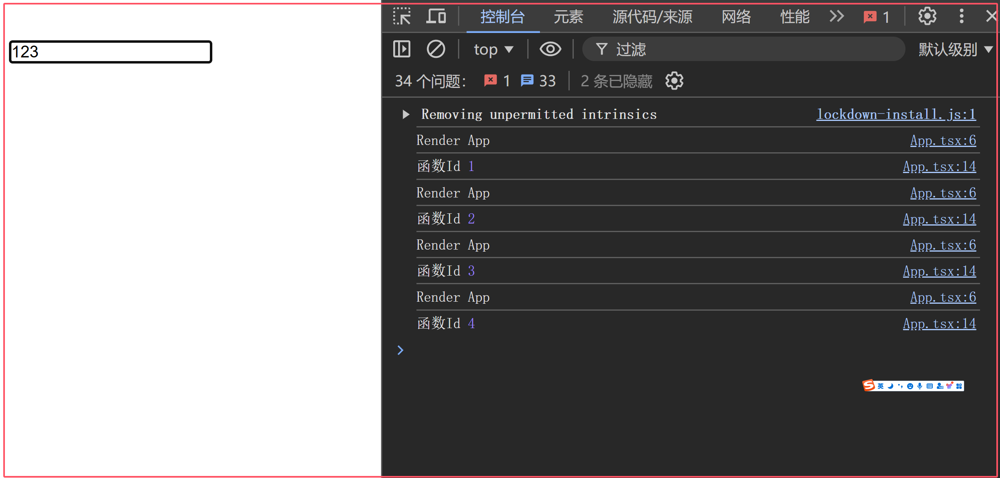
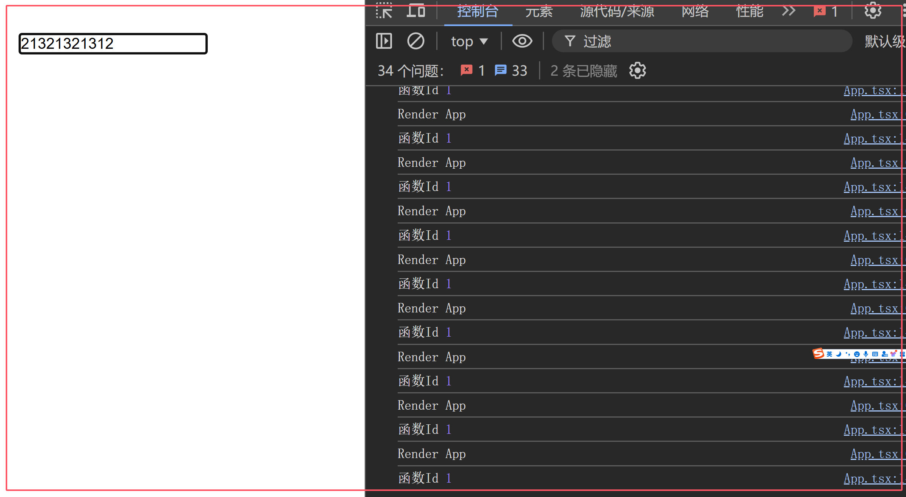

# useCallback

useCallback 用于优化性能，返回一个记忆化的回调函数，可以减少不必要的重新渲染，也就是说它是用于缓存组件内的函数，避免函数的重复创建。

## 为什么需要useCallback

在React中，函数组件的重新渲染会导致组件内的函数被重新创建，这可能会导致性能问题。useCallback 通过缓存函数，可以减少不必要的重新渲染，提高性能。

## 用法

```tsx
const memoizedCallback = useCallback(() => {
  doSomething(a, b);
}, [a, b]);
```

## 参数
入参
- callback：回调函数
- deps：依赖项数组，当依赖项发生变化时，回调函数会被重新创建，跟useEffect一样。

返回值
- 返回一个记忆化的回调函数，可以减少函数的创建次数，提高性能。


## 案例1

来看这个实例：

- 我们创建了一个WeakMap(用Map也行)，用于存储回调函数，并记录回调函数的创建次数。
- 在组件重新渲染时，changeSearch 函数会被重新创建，我们这边会进行验证，如果函数被重新创建了数量会+1，如果没有重新创建，数量默认是1。

```tsx
import { useCallback, useState } from 'react'
const functionMap = new WeakMap()
let counter = 1
const App: React.FC = () => {
   console.log('Render App')
   const [search, setSearch] = useState('')
   const changeSearch = (e: React.ChangeEvent<HTMLInputElement>) => {
      setSearch(e.target.value)
   }
   if(!functionMap.has(changeSearch)) {
      functionMap.set(changeSearch, counter++)
   }
   console.log('函数Id', functionMap.get(changeSearch))
   return <>
      <input type="text" value={search} onChange={changeSearch} />
   </>;
};
export default App;
```
我们更改输入框的值，可以看到函数Id在增加，说明函数被重新创建了。



为什么是4呢，因为默认是1，然后输入框更改了3次，所以是4，那么这样好吗？我们使用useCallback来优化一下。

:::tip
只需要在changeSearch函数上使用useCallback，就可以优化性能。
:::

```tsx
const changeSearch = useCallback((e: React.ChangeEvent<HTMLInputElement>) => {
    setSearch(e.target.value)
}, [])
```
我们可以看到函数Id没有增加，说明函数没有被重新创建。




## 案例2

应用于子组件：

- 我们创建了一个Child子组件，并使用React.memo进行优化，memo在上一章讲过了，他会检测props是否发生变化，如果发生变化，就会重新渲染子组件。
- 我们创建了一个childCallback函数，传递给子组件，然后我们输入框更改值，发现子组件居然重新渲染了，但是我们并没有更改props，这是为什么呢？
- 这是因为输入框的值发生变化，App就会重新渲染，然后childCallback函数就会被重新创建，然后传递给子组件，子组件会判断这个函数是否发生变化，但是每次创建的函数内存地址都不一样，所以子组件会重新渲染。

```tsx
import React, { useCallback, useState } from 'react'
const Child = React.memo(({ user, callback }: { user: { name: string; age: number }, callback: () => void }) => {
   console.log('Render Child')
   const styles = {
      color: 'red',
      fontSize: '20px',
   }
   return <div style={styles}>
      <div>{user.name}</div>
      <div>{user.age}</div>
      <button onClick={callback}>callback</button>
   </div>
})

const App: React.FC = () => {
   const [search, setSearch] = useState('')
   const [user, setUser] = useState({
      name: 'John',
      age: 20
   })
   const childCallback = () => {
      console.log('callback 执行了')
   }
   return <>
      <input type="text" value={search} onChange={e => setSearch(e.target.value)} />
      <Child callback={childCallback} user={user} />
   </>;
};

export default App;
```
因为App重新渲染了，所以childCallback函数会被重新创建，然后传递给子组件，子组件会判断这个函数是否发生变化，但是每次创建的函数内存地址都不一样，所以子组件会重新渲染。


:::tip
只需要在childCallback函数上使用useCallback，就可以优化性能。
:::

```tsx
const childCallback = useCallback(() => {
    console.log('callback 执行了')
}, [])
```

## 总结

useCallback的使用需要有所节制，不要盲目地对每个方法应用useCallback，这样做可能会导致不必要的性能损失。useCallback本身也需要一定的性能开销。

useCallback并不是为了阻止函数的重新创建，而是通过依赖项来决定是否返回新的函数或旧的函数，从而在依赖项不变的情况下确保函数的地址不变。


