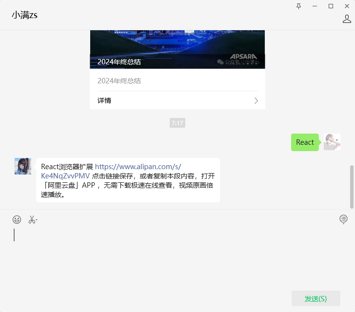

# useDebugValue

`useDebugValue` 是一个专为开发者调试自定义 Hook 而设计的 React Hook。它允许你在 React 开发者工具中为自定义 Hook 添加自定义的调试值。

## 用法

```ts
const debugValue = useDebugValue(value)
```

## 参数说明

### 入参
- `value`: 要在 React DevTools 中显示的值
- `formatter?`: (可选) 格式化函数
  - 作用：自定义值的显示格式
  - 调用时机：仅在 React DevTools 打开时才会调用，可以进行复杂的格式化操作
  - 参数：接收 value 作为参数
  - 返回：返回格式化后的显示值

### 返回值
- 无返回值（void）

## 获取 React DevTools

### 方式一：Chrome 商店安装
1. 访问 [React Developer Tools](https://chromewebstore.google.com/detail/react-developer-tools/fmkadmapgofadopljbjfkapdkoienihi?hl=zh-cn)
2. 点击"添加至 Chrome"即可安装

### 方式二：离线安装
1. 在微信公众号(`小满zs`) 回复 `React/React工具` 获取安装包



:::info 离线安装步骤
1. 打开 Chrome 浏览器，点击右上角三个点 → 更多工具 → 扩展程序
2. 开启右上角的"开发者模式"
3. 将下载的 .crx 文件直接拖拽到扩展程序页面
4. 在弹出的确认框中点击"添加扩展程序"
:::

## 实战案例：自定义 useCookie Hook

下面通过实现一个 `useCookie` Hook 来展示 `useDebugValue` 的实际应用。这个 Hook 提供了完整的 cookie 操作功能，并通过 `useDebugValue` 来增强调试体验。

```tsx
import React, { useState, useDebugValue } from 'react';

const useCookie = (name: string, initialValue: string = '') => {
   const getCookie = () => {
      const match = document.cookie.match(new RegExp(`(^| )${name}=([^;]*)(;|$)`)) 
      return match ? match[2] : initialValue
   }
   const [cookie, setCookie] = useState(getCookie())
   const updateCookie = (value: string, options?: any) => {
      document.cookie = `${name}=${value};${options}`
      setCookie(value)
   }
   const deleteCookie = () => {
      document.cookie = `${name}=;expires=Thu, 01 Jan 1970 00:00:00 GMT`
      setCookie(initialValue)
   }
   useDebugValue(cookie, (value) => {
      return `cookie: ${value}`
   })
   return [cookie, updateCookie, deleteCookie] as const
}

const App: React.FC = () => {
   const [cookie, updateCookie, deleteCookie] = useCookie('key', 'value')
   return (
      <div>
         <div>{cookie}</div>
         <button onClick={() => { updateCookie('update-value') }}>设置cookie</button>
         <button onClick={() => { deleteCookie() }}>删除cookie</button>
      </div>
   );
}

export default App;
```

### Hook 功能说明

1. **getCookie**: 获取指定名称的 cookie 值
2. **updateCookie**: 更新或创建新的 cookie
3. **deleteCookie**: 删除指定的 cookie

### useDebugValue 的应用

在这个例子中，我们使用 `useDebugValue` 来显示当前 cookie 的值：
```ts
useDebugValue(cookie, (value) => `cookie: ${value}`)
```

### 调试效果展示

在 React DevTools 中的显示效果：


更新 cookie 后的显示效果：


### 使用建议

1. 仅在自定义 Hook 中使用 `useDebugValue`
2. 对于简单的值，可以省略 formatter 函数
3. 当格式化值的计算比较昂贵时，建议使用 formatter 函数，因为它只在开发者工具打开时才会执行