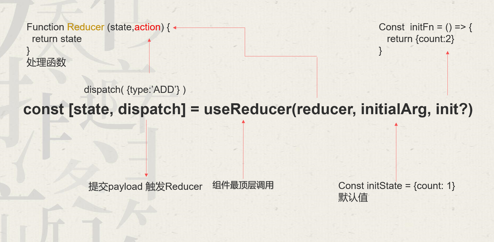

# useReducer

`useReducer`是React提供的一个高级Hook,没有它我们也可以正常开发，但是`useReducer`可以使我们的代码具有更好的可读性，可维护性。

`useReducer` 跟 `useState` 一样的都是帮我们管理组件的`状态`的，但是呢与`useState`不同的是 `useReducer` 是`集中式`的管理状态的。


## 用法



```ts
const [state, dispatch] = useReducer(reducer, initialArg, init?)
```
### 参数:

1. `reducer` 是一个处理函数，用于更新状态, reducer 里面包含了两个参数，第一个参数是 `state`，第二个参数是 `action`。`reducer` 会返回一个新的 `state`。

2. `initialArg` 是 `state` 的初始值。

3. `init` 是一个可选的函数，用于初始化 `state`，如果编写了init函数，则默认值使用init函数的返回值，否则使用`initialArg`。

### 返回值:

useReducer 返回一个由两个值组成的数组：

当前的 state。初次渲染时，它是 init(initialArg) 或 initialArg （如果没有 init 函数）。
dispatch 函数。用于更新 state 并触发组件的重新渲染。

```ts
import { useReducer } from 'react';
//根据旧状态进行处理 oldState，处理完成之后返回新状态 newState
//reducer 只有被dispatch的时候才会被调用 刚进入页面的时候是不会执行的
//oldState 任然是只读的
function reducer(oldState, action) {
  // ...
  return newState;
}

function MyComponent() {
  const [state, dispatch] = useReducer(reducer, { age: 42,name:'小满' });
  // ...
```
## 计数器案例

初始状态 (initialState):
```ts
const initialState = { count: 0 };
```
这里定义了一个初始状态对象，包含一个 count 属性，初始值为 0。


reducer 函数:

```ts
function reducer(state, action) {
  switch (action.type) {
    case 'increment':
      return { count: state.count + 1 };
    case 'decrement':
      return { count: state.count - 1 };
    default:
      throw new Error();
  }
}
```
- reducer 是一个用来根据不同的 action 来更新状态的纯函数。
- 它接收当前状态 (state) 和一个动作对象 (action)，根据 action.type 来决定如何更新 state。
- 如果 action.type 是 'increment'，则 count 增加 1；如果是 'decrement'，则 count 减少 1。
- 如果 action.type 不匹配任何已定义的情况，则抛出一个错误。
App 组件:

```tsx
const App = () =>  {
  const [state, dispatch] = useReducer(reducer, initialState);

  return (
    <>
      Count: {state.count}
      <button onClick={() => dispatch({ type: 'decrement' })}>-</button>
      <button onClick={() => dispatch({ type: 'increment' })}>+</button>
    </>
  );
}
export default App;
```
- 当点击 "-" 按钮时，调用 dispatch({ type: 'decrement' })，使 count 减少。
- 当点击 "+" 按钮时，调用 dispatch({ type: 'increment' })，使 count 增加。

## 购物车案例

1. 初始数据 (initData):
```tsx
const initData = [
  { name: '小满(只)', price: 100, count: 1, id: 1, isEdit: false },
  { name: '中满(只)', price: 200, count: 1, id: 2, isEdit: false },
  { name: '大满(只)', price: 300, count: 1, id: 3, isEdit: false }
]
```
- initData 是一个数组，表示初始的商品列表。每个商品有以下属性：
   - name: 商品的名称（例如 "小满(只)"）。
   - price: 单价（例如 100）。
   - count: 数量，默认为 1。
   - id: 商品的唯一标识符。
   - isEdit: 表示该商品名称是否处于编辑状态，默认为 false。
2. 类型定义 (List 和 Action):
```ts
type List = typeof initData
interface Action { 
  type: "ADD" | "SUB" | 'DELETE' | 'EDIT' | 'UPDATE_NAME', 
  id: number, 
  newName?: string 
}
```
- List 是商品数组的类型，直接从 initData 推断。
- Action 接口定义了不同的操作类型：
   - ADD: 增加某个商品的数量。
   - SUB: 减少某个商品的数量。
   - DELETE: 删除某个商品。
   - EDIT: 切换某个商品的编辑状态。
   - UPDATE_NAME: 更新某个商品的名称。
   - id: 需要操作的商品的 id。
   - newName: 用于 UPDATE_NAME 操作时，新的商品名称。
3. Reducer 函数 (reducer):
```tsx
function reducer(state: List, action: Action) {
  const item = state.find(item => item.id === action.id)!
  switch (action.type) {
    case "ADD":
      item.count++
      return [...state]
    case "SUB":
      item.count--
      return [...state]
    case "DELETE":
      return state.filter(item => item.id !== action.id)
    case "EDIT":
      item.isEdit = !item.isEdit
      return [...state]
    case "UPDATE_NAME":
      item.name = action.newName!
      return [...state]
    default:
      return state
  }
}
```
reducer 函数根据传入的 action 更新商品列表的状态。
查找到要操作的商品 item。

对不同的 action.type 执行相应操作：
- ADD: 将商品数量增加 1。
- SUB: 将商品数量减少 1。
- DELETE: 删除指定商品。
- EDIT: 切换商品的编辑状态（输入框显示或隐藏）。
- UPDATE_NAME: 更新商品的名称。
4. App 组件:
```tsx
function App() {
  let [data, dispatch] = useReducer(reducer, initData)
  return (
    <>
      <table cellPadding={0} cellSpacing={0} width={600} border={1}>
        <thead>
          <tr>
            <th>物品</th>
            <th>价格</th>
            <th>数量</th>
            <th>操作</th>
          </tr>
        </thead>
        <tbody>
          {
            data.map((item) => {
              return (
                <tr key={item.id}>
                  <td align='center'>
                    {item.isEdit ? 
                      <input 
                        onBlur={e => dispatch({ type: "EDIT", id: item.id })} 
                        onChange={e => dispatch({ type: "UPDATE_NAME", id: item.id, newName: e.target.value })} 
                        value={item.name} 
                      /> 
                      : 
                      <span>{item.name}</span>
                    }
                  </td>
                  <td align='center'>{item.price * item.count}</td>
                  <td align='center'>
                    <button onClick={() => dispatch({ type: "SUB", id: item.id })}>-</button>
                    <span>{item.count}</span>
                    <button onClick={() => dispatch({ type: "ADD", id: item.id })}>+</button>
                  </td>
                  <td align='center'>
                    <button onClick={() => dispatch({ type: "EDIT", id: item.id })}>编辑</button>
                    <button onClick={() => dispatch({ type: "DELETE", id: item.id })}>删除</button>
                  </td>
                </tr>
              )
            })
          }
        </tbody>
        <tfoot>
          <tr>
            <td colSpan={3}></td>
            <td align='center'>总价:{data.reduce((prev, next) => prev + next.price * next.count, 0)}</td>
          </tr>
        </tfoot>
      </table>
    </>
  )
}
```
- App 组件使用 useReducer 来管理 data 状态，它从 initData 初始化，并通过 dispatch 分发动作来改变商品列表。
- 商品列表通过 table 渲染，每个商品显示以下信息：
- 物品：如果该商品的 isEdit 为 true，显示一个输入框用于修改名称；否则显示商品名称。
- 价格：显示商品的总价（price * count）。
- 数量：显示商品的数量，提供 - 和 + 按钮来减少或增加数量。
- 操作：提供 编辑 按钮切换名称编辑状态，删除 按钮可以删除该商品。
- tfoot 部分显示购物车的总价，通过 reduce 方法计算所有商品的总价。