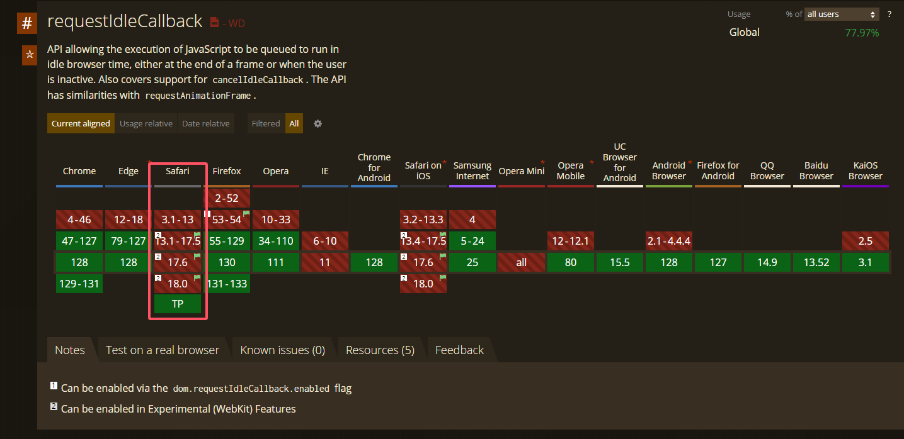

# requestidlecallback

它提供了一种机制，允许开发者在浏览器空闲时运行低优先级的任务，而不会影响关键任务和动画的性能。

## requestidlecallback 执行阶段
1. 处理事件的回调click...事件
2. 处理计时器的回调
3. 开始帧
4. 执行requestAnimationFrame 动画的回调
5. 计算机页面布局计算 合并到主线程
6. 绘制
7. 如果此时还有空闲时间，执行requestIdleCallback

## requestidlecallback 基本用法

requestidlecallback 接受一个回调函数 `callback` 并且在回调函数中会注入参数 `deadline`

deadline有两个值:

- `deadline.timeRemaining()` 返回是否还有空闲时间(毫秒)

- `deadline.didTimeout` 返回是否因为超时被强制执行(布尔值)
 
options: 

- `{ timeout: 1000 }` 指定回调的最大等待时间（以毫秒为单位）。如果在指定的 timeout 时间内没有空闲时间，回调会强制执行，避免任务无限期推迟


这个案例模拟了在浏览器空闲时，渲染`1000`条dom元素，非常流畅

```js
const total = 1000; // 定义需要生成的函数数量，即1000个任务
const arr = [];    // 存储任务函数的数组

// 生成1000个函数并将其添加到数组中
function generateArr() {
    for (let i = 0; i < total; i++) {
        // 每个函数的作用是将一个 <div> 元素插入到页面的 body 中
        arr.push(function() {
            document.body.innerHTML += `<div>${i + 1}</div>`; // 将当前索引 + 1 作为内容
        });
    }
}
generateArr(); // 调用函数生成任务数组

// 用于调度和执行任务的函数
function workLoop(deadline) {
    // 检查当前空闲时间是否大于1毫秒，并且任务数组中还有任务未执行
    if (deadline.timeRemaining() > 1 && arr.length > 0) {
        const fn = arr.shift(); // 从任务数组中取出第一个函数
        fn(); // 执行该函数，即插入对应的 <div> 元素到页面中
    }
    // 再次使用 requestIdleCallback 调度下一个空闲时间执行任务
    requestIdleCallback(workLoop);
}

// 开始调度任务，在浏览器空闲时执行 workLoop
requestIdleCallback(workLoop,{ timeout: 1000});
```

## 面试官可能会问的问题

### 为什么React不用原生requestIdleCallback实现呢？

1. `兼容性差` `Safari` 并不支持(如下附图)
https://caniuse.com/?search=requestIdleCallback


2. `控制精细度` React 要根据组件优先级、更新的紧急程度等信息，更精确地安排渲染的工作

3. `执行时机`requestIdleCallback(callback) 回调函数的执行间隔是 50ms（W3C规定），也就是 20FPS，1秒内执行20次，间隔较长。

4. `差异性` 每个浏览器实现该API的方式不同，导致执行时机有差异有的快有的慢




### requestIdleCallback替代方案是什么?

`MessageChannel`

选择 `MessageChannel` 的原因，是首先异步得是个宏任务，因为宏任务中会在下次事件循环中执行，不会阻塞当前页面的更新。`MessageChannel` 是一个宏任务。

没选常见的 `setTimeout`，是因为`MessageChannel` 能较快执行，在 0～1ms 内触发，像 setTimeout 即便设置 timeout 为 0 还是需要 4～5ms。相同时间下，MessageChannel 能够完成更多的任务。


MDN https://developer.mozilla.org/zh-CN/docs/Web/API/setTimeout


若浏览器不支持 `MessageChannel`，还是得降级为 setTimeout。

### MessageChannel基本用法

MessageChanne设计初衷是为了方便 我们在不同的上下文之间进行通讯，例如`web Worker`,`iframe`
它提供了两个端口（port1 和 port2），通过这些端口，消息可以在两个独立的线程之间双向传递

```js
// 创建 MessageChannel
const channel = new MessageChannel();
const port1 = channel.port1;
const port2 = channel.port2;

// 设置 port1 的消息处理函数
port1.onmessage = (event) => {
    console.log('Received by port1:', event.data);
    port1.postMessage('Reply from port1'); // 向 port2 发送回复消息
};

// 设置 port2 的消息处理函数
port2.onmessage = (event) => {
    console.log('Received by port2:', event.data);
};

// 通过 port2 发送消息给 port1
port2.postMessage('Message from port2');
```

### 实现react调度器