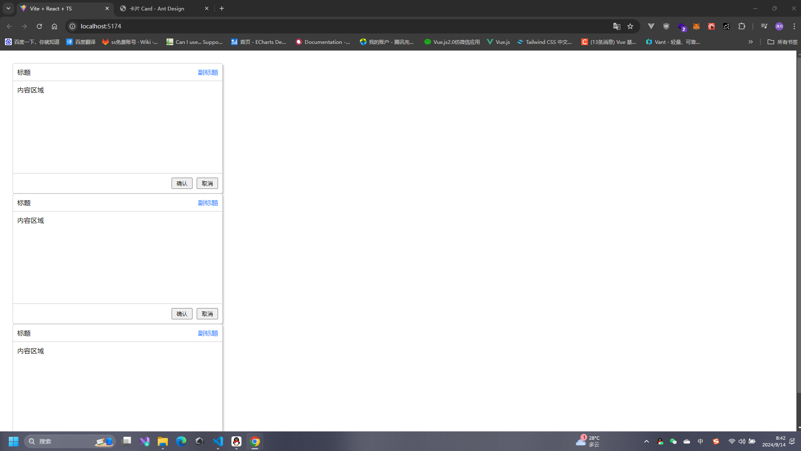

# 组件

## 什么是组件？

此时App是一个单体，我们在真正做项目的时候，我们需要把它分解成可管理的，可描述的组件。
React 对于什么是组件和什么不是组件并没有任何硬性规定，这完全取决于你！

React 优秀项目 https://win11.blueedge.me/

获取本章代码 https://github.com/message163/react-course.git 分支 `card-component`

## 定义第一个组件

如果你没有组件开发的经验，那你一定要记住我的准则:


   - 如果它在程序里是一个块，那么它就是一个组件
   - 如果它在程序里面经常出现，那么也它也是组件

   使用通用的 UI 元素作为组件，可以让你只更改一处，就能更改所有使用该组件的地方


## 编写Card组件

例如项目中经常会用到一个卡片组件我们来编写一个卡片组件

我们新建一个文件夹`components`

目录结构：

- components
 - Card
    - index.tsx
    - index.css

### index.css

```css
.card {
    background: white;
    border-radius: 5px;
    border: 1px solid #ccc;
    max-width: 500px;
    box-shadow: 3px 3px 3px #ccc;

    header {
        display: flex;
        justify-content: space-between;
        align-items: center;
        border-bottom: 1px solid #ccc;
        padding: 10px;

        div:last-child {
            color: #1677ff;
        }
    }

    main{
        min-height: 200px;
        border-bottom: 1px solid #ccc;
        padding: 10px;
    }
    footer {
        display: flex;
        justify-content: flex-end;
        align-items: center;
        padding: 10px;
        button{
            margin-left: 10px;
            padding: 3px 10px;
        }
    }
}
```
index.tsx

```tsx
import './index.css'

export default function Card() {
    return (
        <div className='card'>
            <header>
                <div>标题</div>
                <div>副标题</div>
            </header>
            <main>
                内容区域
            </main>
            <footer>
                 <button>确认</button>
                 <button>取消</button>
            </footer>
        </div>
    )
}
```
App.tsx 引入Card 组件

这种称之为局部组件在哪一个页面需要使用就在哪一个页面引入即可！

```tsx
import Card from './components/Card'
function App() {
  return (
    <>
      <Card></Card>
      <Card></Card>
      <Card></Card>
    </>
  )
}
```


## 全局组件

目录结构：

- components
 - Message
    - index.tsx
    - index.css

Message/index.css

```css
.message {
    width: 160px;
    height: 30px;
    position: fixed;
    top: 10px;
    left:50%;
    margin-left: -80px;
    background: #fff;
    border: 1px solid #ccc;
    text-align: center;
    line-height: 30px;
    border-radius: 5px;
}
```

Message/index.tsx

创建一个queue队列因为可以点击多次需要存到数组，并且累加每次的高度，使元素没有进行重叠，而是顺移，所以需要一个queue队列，删除的时候就按顺序删除即可。

```tsx
import ReactDom from 'react-dom/client'
import './index.css'
const Message = () => {
    return (
        <div>
            提示组件
        </div>
    )
}
interface Itesm {
    messageContainer: HTMLDivElement
    root: ReactDom.Root
}
const queue: Itesm[] = []
window.onShow = () => {
    const messageContainer = document.createElement('div')
    messageContainer.className = 'message'
    messageContainer.style.top = `${queue.length * 50}px`
    document.body.appendChild(messageContainer)
    const root = ReactDom.createRoot(messageContainer)
    root.render(<Message />) //渲染组件
    queue.push({
        messageContainer,
        root
    })
    //2秒后移除
    setTimeout(() => {
        const item = queue.find(item => item.messageContainer === messageContainer)!
        item.root.unmount() //卸载
        document.body.removeChild(item.messageContainer)
        queue.splice(queue.indexOf(item), 1)
    }, 2000)
}

//声明扩充
declare global {
    interface Window {
        onShow: () => void
    }
}


export default Message
```

在main.tsx 注入即可使用 `import './components/Message/index.tsx'`

App.tsx Card.tsx 使用

```tsx
 <button onClick={() => window.onShow()}>确认</button>
```

