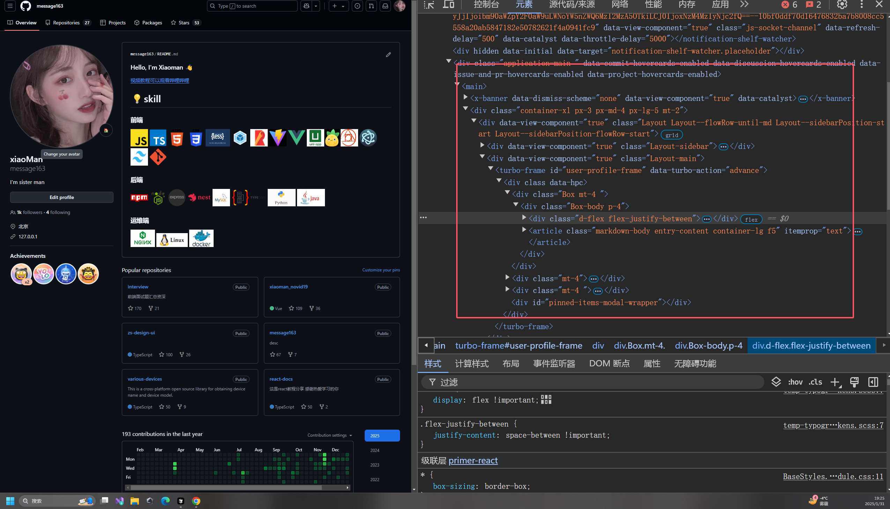

# 原子化 css 

## 什么是原子化 css

原子化 CSS 是一种现代 CSS 开发方法，它将 CSS 样式拆分成最小的、单一功能的类。比如一个类只负责设置颜色，另一个类只负责设置边距。这种方式让样式更容易维护和复用，能提高开发效率，减少代码冗余。通过组合这些小型样式类，我们可以构建出复杂的界面组件。

## 原子化 css 基本概念

原子化 css 是一种css的编程范式，它将css的样式拆分成最小的单元，每个单元都是一个独立的css类，通过这些独立的css类来构建整个页面的样式，简单举个例子：

:::tip
其核心思想就是无需重复定义样式，只需定义一次，然后通过组合这些小型样式类，来构建出复杂的界面组件。
:::


```html
<style>
  .color-red { color: red }
  .text-center { text-align: center }
  .p-10 { padding: 10px }
</style>
<section class="bg-red text-center p-10">
    原子化 css
</section>
```


## 那么有谁在用呢？

例如比较知名的网站有: `x` `Github` 等，他们都是使用原子化 css 来构建他们的网站。

- [Github 网址](https://github.com/message163)



- [x 网址](https://x.com/zmy2697)


## TailWind Css

[TailWind Css 官网](https://tailwindcss.com/)

TailWind 是原子化 css 的一种实现方式，它内置了许多细粒度的 class 类，这些细粒度的 class 类可以组合使用，来构建出复杂的界面组件。


## 如何使用 TailWind Css 4.0.1 最新版

- vite 项目

```bash
npm install tailwindcss @tailwindcss/vite
```
1. vite.config.ts

引入 `tailwindcss` 插件，然后配置 `tailwindcss` 插件

```ts
import { defineConfig } from 'vite'
import react from '@vitejs/plugin-react-swc'
import tailwindcss from '@tailwindcss/vite'
export default defineConfig({
  plugins: [react(), tailwindcss()],
})

```
2. src/tailwind.css (新建一个文件)
引入 `tailwindcss` 的样式
```css
@import "tailwindcss";
```

3. src/main.tsx

引入 `tailwindcss` 的样式

```tsx
import './tailwind.css'
```

4. src/App.tsx
试用 `tailwindcss` 的样式

```tsx
<section class="bg-red text-center p-10">
    原子化 css
</section>
```

5. 打开Vscode或者Cursor,安装 `TailWind Css` 插件,这样编写代码的时候，会自动提示 `tailwindcss` 的样式


## 案例

### 简单使用 `tailwindcss` 来构建一个 欢迎页

```tsx
import React, { } from 'react';
const App: React.FC = () => {
  return (
    <>
      <div className="bg-gradient-to-r from-pink-600 to-purple-600 h-screen w-screen flex justify-center items-center">
          <div className='text-white text-4xl font-bold hover:text-gray-300'>
             大家好我是小满zs,欢迎来到我的博客
          </div>
      </div>
    </>
  );
}

export default App;
```


### 进阶用法@apply

我们可以看到上述代码中，类名用了很多都是堆在一起的，这样看起来很不美观，我们可以使用 `tailwindcss` 的 `@apply` 来解决这个问题。

- src/tailwind.css

```css
@import "tailwindcss";

.blob-bg {
    @apply bg-gradient-to-r from-pink-600 to-purple-600 h-screen w-screen flex justify-center items-center;
}

.blob-text {
    @apply text-white text-4xl font-bold hover:text-gray-300;
}
```

- src/App.tsx

效果是一样的，但是看起来更美观了

```tsx
<div className="blob-bg">
    <div className="blob-text">
        大家好我是小满zs,欢迎来到我的博客
    </div>
</div>
```
更多用法请参考 [tailwindcss 自定义样式](https://tailwindcss.com/docs/adding-custom-styles)


