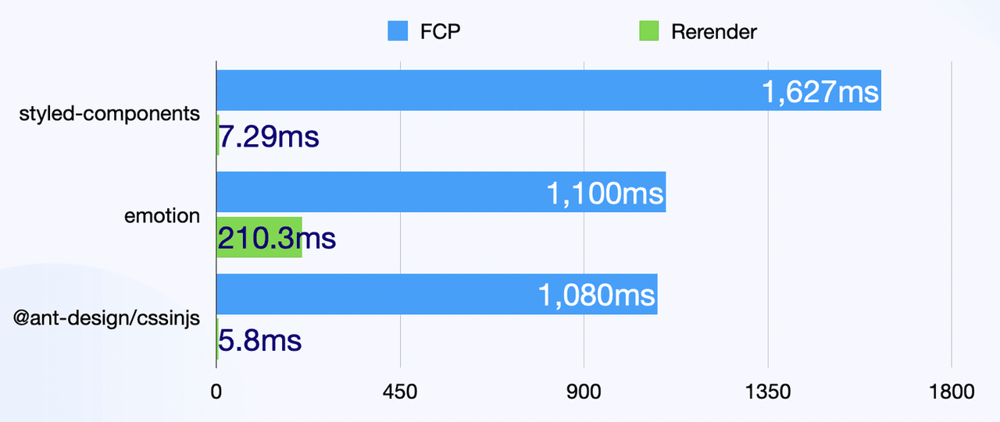
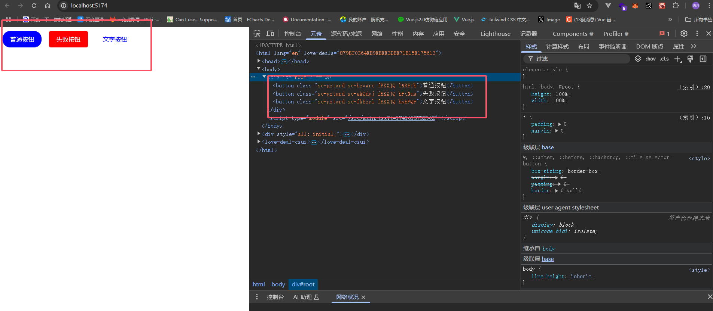

# css-in-js

`css-in-js` 是将 CSS 代码 跟 JS 代码 混合在一起，通过 JS 来动态的生成 CSS 样式，但是这样的话与我们的认知是背道而驰的，正常应该是 CSS JS HTML 分离的，但是由于 CSS 缺乏作用域，所以形成了 `css-in-js` 这种写法，注意 `css-in-js` 并不是一种技术，而是一种思想。

正所谓 前端三大件 分久必合合久必分。 


## 优缺点

### 优点：

- 可以让 CSS 拥有独立的作用域，阻止 CSS 泄露到组件外部，防止冲突。
- 可以动态的生成 CSS 样式，根据组件的状态来动态的生成 CSS 样式。
- CSS-in-JS 可以方便地实现主题切换功能，只需更改主题变量即可改变整个应用的样式。

### 缺点：

- css-in-js 是基于运行时，所以会损耗一些性能(电脑性能高可以忽略)
- 调试困难，CSS-in-JS 的样式难以调试，因为它们是动态生成的，而不是在 CSS 文件中定义的。


## 谁在用？

- 最常见的有 `Antd` 用它自研的 `css-in-js` 库

[Antd 官网](https://ant-design.antgroup.com/index-cn)

css-in-js 库有很多，比如 `styled-components`、`emotion`、等等，因为它只是思想，所以很多库都实现了它，但是这些库的实现方式都不一样，所以使用的时候需要根据实际情况选择合适的库，所以 `Antd` 选择了自研。

[Antd 的 css-in-js 库](https://ant-design.github.io/cssinjs/)




## 案例

我们以 `styled-components` 为例，来实现一个简单的 `css-in-js` 案例。

:::tip
[styled-components 官网](https://styled-components.com/)
:::

1. 安装 `styled-components`

```bash
npm install styled-components
```

2. 创建一个 `Button` 组件

```tsx
import React, {} from 'react';
import styled from 'styled-components';
const Button = styled.button<{primary?: boolean}>`
   ${props => props.primary ? 'background: #6160F2;' : 'background: red;'}
   padding: 10px 20px;
   border-radius: 5px;
   color: white;
   cursor: pointer;
   margin: 10px;
   &:hover {
     color: black;
   }
`;
const App: React.FC = () => {
  return (
    <>
        <Button primary>
            按钮
        </Button>
    </>
  );
}

export default App;
```


我们可以看到，`Button` 组件的类名是通过`js`随机生成的的，这样就避免了类名冲突的问题。


## 更多用法


### 继承

我们可以实现一个基础的 `Button` 组件，然后通过继承来实现更多的按钮样式。

比如例子中的 `ButtonBase` 组件，然后基于基础样式实现了，`BlueButton`、`FailButton`、`TextButton` 组件，利于我们复用基础样式，以及快速封装组件。

```tsx
import React, { } from 'react';
import styled from 'styled-components';
const ButtonBase = styled.button`
   padding: 10px 20px;
   border-radius: 5px;
   color: white;
   cursor: pointer;
   margin: 10px;
   &:hover {
     color: red;
   }
`;

//圆角蓝色按钮
const BlueButton = styled(ButtonBase)`
   background-color: blue;
   border-radius: 20px;
`;
//失败按钮
const FailButton = styled(ButtonBase)`
   background-color: red;
`;
//文字按钮
const TextButton = styled(ButtonBase)`
   background-color: transparent;
   color: blue;
`;
const App: React.FC = () => {
  return (
    <>
       <BlueButton>普通按钮</BlueButton>
       <FailButton>失败按钮</FailButton>
       <TextButton>文字按钮</TextButton>
    </>
  );
}

export default App;
```




### 属性

我们可以通过 `attrs` 来给组件添加属性，比如 `defaultValue`，然后通过 `props` 来获取属性值。

```tsx
import React, { } from 'react';
import styled from 'styled-components';
interface DivComponentProps {
  defaultValue: string;
}
const InputComponent = styled.input.attrs<DivComponentProps>((props) => ({
  type: 'text',
  defaultValue: props.defaultValue,
}))`
 border:1px solid blue;
 margin:20px;
`

const App: React.FC = () => {
  const defaultValue = '小满zs'
  return (
    <>
      <InputComponent defaultValue={defaultValue}></InputComponent>
    </>
  );
}

export default App;
```

### 全局样式

我们可以通过 `createGlobalStyle` 来创建全局样式, 然后放到 `App` 组件中。

```tsx
import React, { } from 'react';
import styled, { createGlobalStyle } from 'styled-components';
const GlobalStyle = createGlobalStyle`
  body {
    background-color: #f0f0f0;
  },
  * {
    margin: 0;
    padding: 0;
    box-sizing: border-box;
  }
  ul,ol{
      list-style: none;
  }
`
const App: React.FC = () => {
  return (
    <>
      <GlobalStyle />
    </>
  );
}

export default App;
```


### 动画

我们可以通过 `keyframes` 来创建动画。

```tsx
import React, { } from 'react';
import styled, { createGlobalStyle,keyframes } from 'styled-components';


const move = keyframes`
  0%{
    transform: translateX(0);
  }
  100%{
    transform: translateX(100px);
  }
`
const Box = styled.div`
  width: 100px;
  height: 100px;
  background-color: red;
  animation: ${move} 1s linear infinite;
`
const App: React.FC = () => {
  return (
    <>
      <Box></Box>
    </>
  );
}

export default App;
```


## 原理剖析

这个技术叫`标签模板`， 是ES6 新增的特性，它可以紧跟在函数后面，该函数将被用来调用这个字符串模板

调用完成之后,这个函数的第一个参数是模板字符串的静态字符串,从第二个参数开始,是模板字符串中变量值,也就是${}里面的值

- `strArr：['\n  color:red;\n  width:', 'px;\n  height:', 'px;\n', raw: Array(3)] `
- `args：[30, 50]`

```ts
const div = function (strArr: TemplateStringsArray, ...args: any[]) {
   return strArr.reduce((result, str, i) => {
    return result + str + (args[i] || '')
   }, '')
}

const a = div`
  color:red;
  width:${30}px;
  height:${50}px;
`
console.log(a)
//  输出结果
//  color:red;
//  width:30px;
//  height:50px;
```