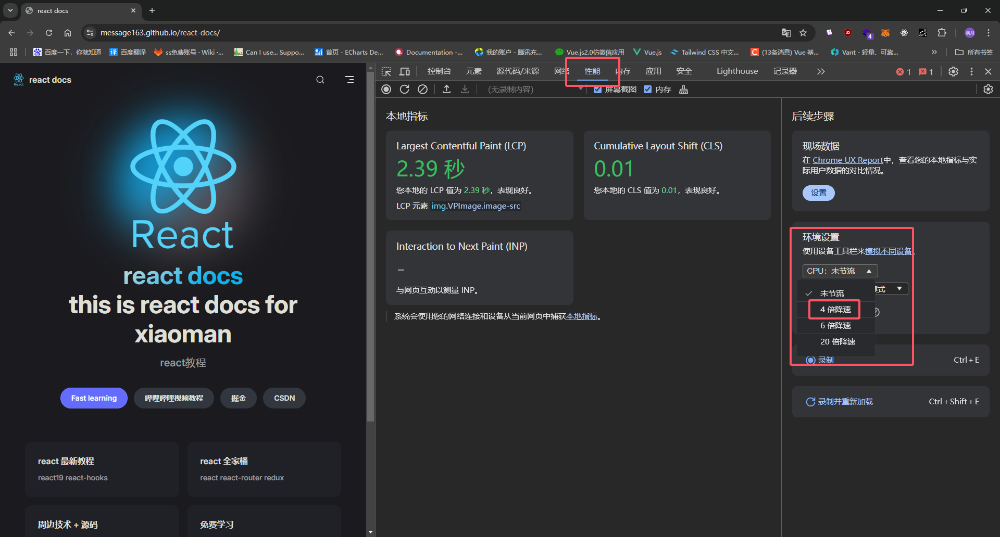

# useTransition

`useTransition` 是 React 18 中引入的一个 Hook，用于管理 UI 中的过渡状态，特别是在处理长时间运行的状态更新时。它允许你将某些更新标记为“过渡”状态，这样 React 可以优先处理更重要的更新，比如用户输入，同时延迟处理过渡更新。

## 用法

```ts
const [isPending, startTransition] = useTransition();
```
### 参数 
`useTransition` 不需要任何参数

### 返回值 
`useTransition` 返回一个数组,包含两个元素

1. `isPending`(boolean)，告诉你是否存在待处理的 transition。
2. `startTransition`(function) 函数，你可以使用此方法将状态更新标记为 transition。

### 优先级

(一般) 不是很重要，因为在实际工作中应用`较少`

## 例子

我们需要模拟数据很多的场景，这里使用`mockjs`模拟数据, 我所用的工具，超出你的想象，我用过很多工具和插件。

并且我们结合vite插件实现一个api,这个api可以帮助我们模拟数据

```sh
npm install mockjs
```
mockjs文档地址：https://github.com/nuysoft/Mock/wiki/Getting-Started

```ts
import { defineConfig } from 'vite'
import react from '@vitejs/plugin-react-swc'
import type { Plugin } from 'vite'
import mockjs from 'mockjs'
import url from 'node:url';
const viteMockServer = (): Plugin => {
  return {
    name: "vite-mock-server",
    //使用vite插件的钩子函数
    configureServer(server) {
      server.middlewares.use('/api/list', async (req, res) => {
        const parsedUrl = url.parse(req.originalUrl, true);
        //获取url参数 true表示返回对象 {keyWord: 'xx'}
        const query = parsedUrl.query;
        res.setHeader('Content-Type', 'application/json')
        const data = mockjs.mock({
          //返回1000条数据
          "list|1000": [
            {
              "id|+1": 1, //id自增
              "name": query.keyWord, //name为url参数中的keyWord
              'address': '@county(true)', //address为随机地址
            }
          ]
        })
        //返回数据
        res.end(JSON.stringify(data))
      })
    }
  }
}
// https://vitejs.dev/config/
export default defineConfig({
  plugins: [react(), viteMockServer()],
})
```

编写完成访问我们的接口 `http://localhost:5174/api/list?keyWord=xx` 5174为默认端口，可以自行更改，返回数据如下


#### 前端

组件结构

在我们的示例中，我们创建了一个简单的输入框和一个列表，用于展示基于输入关键词的结果。以下是组件的主要部分：

>Input, Flex, List 来源`antd` https://ant.design/components/input/

```sh
npm install antd
```

```tsx
import { useTransition, useState } from 'react';
import { Input, Flex, List } from "antd";
interface Item {
   id: number;
   name: string;
   address: string
}
const App = () => {
   const [inputValue, setInputValue] = useState('');
   const [isPending, startTransition] = useTransition(); // 开始过渡
   const [list, setList] = useState<Item[]>([])
   const handleInputChange = (e: React.ChangeEvent<HTMLInputElement>) => {
      const value = e.target.value
      setInputValue(value)
      fetch(`/api/list?keyWord=${value}`).then(res => res.json()).then(data => {
         const res = data?.list ?? [];
         // 使用过渡 useTransition
         startTransition(() => {
            setList([...res])
         })
         //不使用过渡 useTransition
         //setList([...res])
      })
   }
   return (
      <>
         <Flex>
            <Input
               value={inputValue}
               onChange={handleInputChange} // 实时更新
               placeholder="请输入姓名"
            />
         </Flex>
         {
            isPending && <div>loading...</div>
         }
         <List
            dataSource={list}
            renderItem={(item) => (
               <List.Item>
                  <List.Item.Meta
                     title={item.name}
                     description={item.address}
                  />
               </List.Item>
            )}
         />
      </>
   );
}

export default App;
```

1. 输入框和状态管理
使用 useState Hook 管理输入框的值和结果列表。
每次输入框的内容变化时，handleInputChange 函数会被触发，它会获取用户输入的值，并进行 API 请求。
2. API 请求
在 handleInputChange 中，输入的值会作为查询参数发送到 /api/list API。API 返回的数据用于更新结果列表。
为了优化用户体验，我们将结果更新放在 startTransition 函数中，这样 React 可以在处理更新时保持输入框的响应性。
3. 使用 useTransition
useTransition 返回一个布尔值 isPending，指示过渡任务是否仍在进行中。
当用户输入时，如果正在加载数据，我们会显示一个简单的“loading...”提示，以告知用户当前操作仍在进行。
4. 列表渲染
使用 List 组件展示返回的结果，列表项显示每个结果的 name 和 address。

#### 为了更好的测试结果可以在性能中降级cpu渲染速度



## 注意事项

startTransition必须是同步的


错误做法
```ts
startTransition(() => {
  // ❌ 在调用 startTransition 后更新状态
  setTimeout(() => {
    setPage('/about');
  }, 1000);
});
```
正确做法

```ts
setTimeout(() => {
  startTransition(() => {
    // ✅ 在调用 startTransition 中更新状态
    setPage('/about');
  });
}, 1000);
```

**async await** 错误做法

```ts
startTransition(async () => {
  await someAsyncFunction();
  // ❌ 在调用 startTransition 后更新状态
  setPage('/about');
});
```

正确做法

```ts
await someAsyncFunction();
startTransition(() => {
  // ✅ 在调用 startTransition 中更新状态
  setPage('/about');
});
```


## 原理剖析

useTransition 的核心原理是将一部分状态更新处理为低优先级任务，这样可以将关键的高优先级任务先执行，而低优先级的过渡更新则会稍微延迟处理。这在渲染大量数据、进行复杂运算或处理长时间任务时特别有效。React 通过调度机制来管理优先级：

1. 高优先级更新：直接影响用户体验的任务，比如表单输入、按钮点击等。
2. 低优先级更新：相对不影响交互的过渡性任务，比如大量数据渲染、动画等，这些任务可以延迟执行。

```txt
+-----------------------+
|         App           |
|                       |
|  +--------------+     |
|  |    Input     |     |
|  +--------------+     |
|                       |
|  +--------------+     |
|  |   Display    |     |
|  +--------------+     |
+-----------------------+

用户输入
    |
    v
[高优先级更新] ---> [调度器] ---> [React 更新组件]
    |
    +---> [低优先级过渡更新] --> [调度器] --> [等待处理]
```