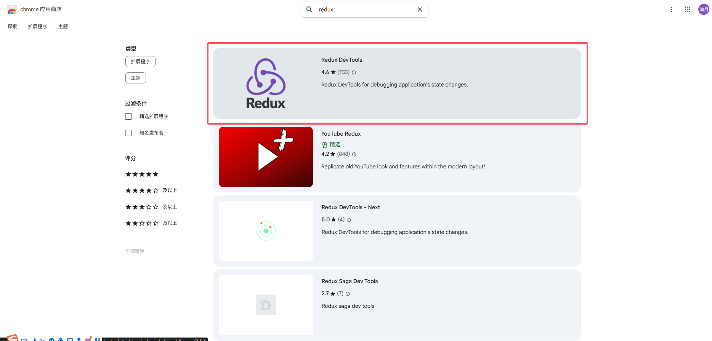
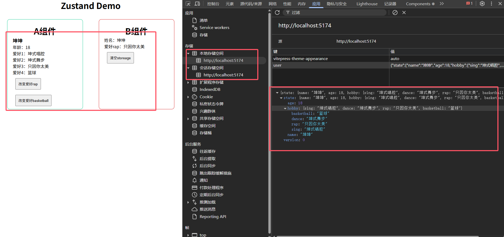

# 中间件

zustand 的中间件是用于在状态管理过程中添加额外逻辑的工具。它们可以用于日志记录、性能监控、数据持久化、异步操作等。


## 自定义编写中间件

我们实现一个简易的日志中间件，了解其中间件的实现原理, zustand的中间件是一个高阶函数，你问我有多高，三四楼那么高啦

```ts
const logger = (config) => (set, get, api) => config((...args) => {
    console.log(api)
    console.log('before', get())
    set(...args)
    console.log('after', get())
}, get, api)
```

参数解释：
1. config (外层函数参数)
    - 类型：函数 (set, get, api) => StoreApi
    - 作用：原始创建 store 的配置函数，由用户传入。中间件需要包装这个函数。

2. set (内层函数参数)
    - 类型：函数 (partialState) => void
    - 作用：原始的状态更新函数，用于修改 store 的状态。

3. get (内层函数参数)
    - 类型：函数 () => State
    - 作用：获取当前 store 的状态值。

4. api (内层函数参数)
    - 类型：对象 StoreApi
    - 作用：包含 store 的完整 API（如 setState, getState, subscribe, destroy 等方法）。

## 使用示例

```ts
const useUserStore = create<User>()(immer(logger((set) => ({
    name: '坤坤',
    age: 18,
    hobby: {
        sing: '坤式唱腔',
        dance: '坤式舞步',
        rap: '坤式rap',
        basketball: '坤式篮球'
    },
    setHobbyRap: (rap: string) => set((state) => {
        state.hobby.rap = rap
    }),
    setHobbyBasketball: (basketball: string) => set((state) => {
        state.hobby.basketball = basketball
    })
}))))
```


## devtools

devtools 是 zustand 提供的一个用于调试的工具，它可以帮助我们更好地管理状态。

1. 需要安装浏览器插件 `Redux DevTools` [下载地址](https://chromewebstore.google.com/search/redux?hl=zh-cn)

2. 在浏览器中打开 `Redux DevTools` 插件，并连接到当前页面



```ts
import { devtools } from 'zustand/middleware'
const useUserStore = create<User>()(
    immer(
        devtools((set) => ({
            name: '坤坤',
            age: 18,
            hobby: {
                sing: '坤式唱腔',
                dance: '坤式舞步',
                rap: '坤式rap',
                basketball: '坤式篮球'
            },
            setHobbyRap: (rap: string) => set((state) => {
                state.hobby.rap = rap
            }),
            setHobbyBasketball: (basketball: string) => set((state) => {
                state.hobby.basketball = basketball
            })
        }),
            {
                enabled: true, // 是否开启devtools
                name: '用户信息', // 仓库名称
            }
        )
    )
)
```


## persist

persist 是 zustand 提供的一个用于持久化状态的工具，它可以帮助我们更好地管理状态，默认是存储在 localStorage 中，可以指定存储方式


```ts
import { persist } from 'zustand/middleware'
const useUserStore = create<User>()(
    immer(
        persist((set) => ({
            name: '坤坤',
            age: 18,
            hobby: {
                sing: '坤式唱腔',
                dance: '坤式舞步',
                rap: '坤式rap',
                basketball: '坤式篮球'
            },
            setHobbyRap: (rap: string) => set((state) => {
                state.hobby.rap = rap
            }),
            setHobbyBasketball: (basketball: string) => set((state) => {
                state.hobby.basketball = basketball
            })
        }),
            {
                name: 'user', // 仓库名称(唯一)
                storage: createJSONStorage(() => localStorage), // 存储方式 可选 localStorage sessionStorage IndexedDB 默认localStorage
                partialize: (state) => ({
                    name: state.name,
                    age: state.age,
                    hobby: state.hobby
                }) // 部分状态持久化
            }
        )
    )
)
```

清空缓存Api, 在页面中添加一个按钮，点击按钮清空缓存,在增加persist中间件之后会自动增加一个clearStorage方法,用于清空缓存。

```ts
import useUserStore from '../../store/user';
const App = () => {
    const clear = () => {
        useUserStore.persist.clearStorage()
    }
    return <div onClick={clear}>清空缓存</div>
}
```


