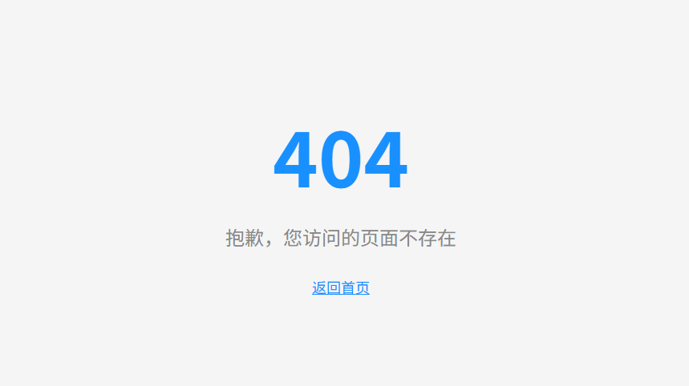

# 边界处理

边界处理包含了`错误处理`，`ErrorBoundary` `404页面等错误处理`


## 404页面处理

404页面指的是当React-router路由匹配不到时，显示的页面，例如我们的路由是/home,/about,当你去跳转到一个不存在的路由比如/aaa时，就会显示404页面。
不过react-router自带的404页面太丑了，更多的时候我们需要自定义404页面。

配置

- 使用`*`作为通配符，当路由匹配不到时，显示404页面
- 使用`Component: NotFound`作为404页面组件

```ts
const router = createBrowserRouter([
    {
        path: '/index',
        Component: Layout,
        children: [
            {
                path: 'home',
                Component: Home,
            },
            {
                path: 'about',
                Component: About,
            },
        ],
    },
    {
        path: '*', // [!code highlight] 通配符，当路由匹配不到时，显示404页面  
        Component: NotFound, // [!code highlight] 404页面组件
    },
]);
```
404.tsx

```tsx
import { Link } from 'react-router'
export default function NotFound() {
    return (
        <div style={{
            height: '100vh',
            display: 'flex',
            flexDirection: 'column',
            alignItems: 'center',
            justifyContent: 'center',
            background: '#f5f5f5'
        }}>
            <h1 style={{ fontSize: 96, color: '#1890ff', margin: 0 }}>404</h1>
            <p style={{ fontSize: 24, color: '#888', margin: '16px 0 0 0' }}>
                抱歉，您访问的页面不存在
            </p>
            <Link
                to="/"
                style={{
                    marginTop: 32,
                    color: '#1890ff',
                    fontSize: 18,
                    textDecoration: 'underline'
                }}
            >
                返回首页
            </Link>
        </div>
    )
}
```




## ErrorBoundary

ErrorBoundary是用于捕获路由loader或action的错误，并进行处理。   

如果loader或action抛出错误，会调用ErrorBoundary组件。

```tsx
import NotFound from '../layout/404'; // 404页面组件
import Error from '../layout/error'; // 错误处理组件
const router = createBrowserRouter([
    {
        path: '/index',
        Component: Layout,
        children: [
            {
                path: 'home',
                Component: Home,
                ErrorBoundary: Error, //如果组件抛出错误，会调用ErrorBoundary组件
            },
            {
                path: 'about',
                loader: async () => {
                    //throw new Response('Not Found', { status: 404, statusText: 'Not Found' }); 可以返回Response对象
                    //也可以返回json等等
                    throw {
                        message: 'Not Found',
                        status: 404,
                        statusText: 'Not Found',
                        data: '132131',
                    }
                },
                Component: About,
                ErrorBoundary: Error, //如果loader或action抛出错误，会调用ErrorBoundary组件
            },
        ],
    },
    {
        path: '*', 
        Component: NotFound,
    },
]);
```

并且返回的错误信息可以通过一个hooks获取到

error.tsx
```tsx
import { useRouteError } from 'react-router'

export default function Error() {
    const error = useRouteError()
    return <div>{error.message}</div>
}
```
