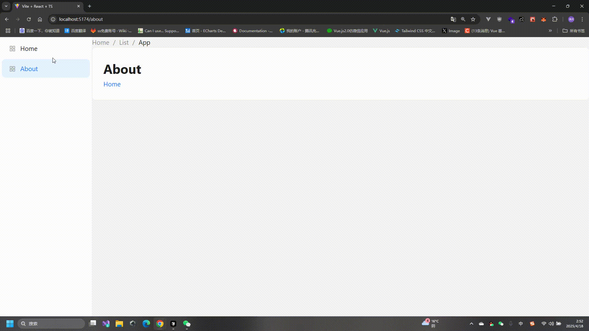

# 懒加载

## 什么是懒加载

懒加载是一种优化技术，用于延迟加载组件，直到需要时才加载。这样可以减少初始加载时间，提高页面性能。

### 懒加载的实现

通过在路由对象中使用 `lazy` 属性来实现懒加载。

```ts
import { createBrowserRouter } from 'react-router';
const sleep = (ms: number) => new Promise(resolve => setTimeout(resolve, ms)); // 模拟异步请求
const router = createBrowserRouter([
    {
        Component: Layout,
            {
                path: 'about',
                lazy: async () => {
                    await sleep(2000); // 模拟异步请求
                    const Component = await import('../pages/About'); // 异步导入组件
                    console.log(Component);
                    return {
                        Component: Component.default,
                    }
                }
            },
        ],
    },
]);
```

当切换到 `about` 路由时，才会进行加载

:::tip
如果配置了 `loader` 则每次都会进入`loading`状态，如果没有配置 `loader` 则只执行一次。
:::


## 体验优化

例如 `about` 是一个懒加载的组件，在切换到 `about` 路由时，展示的还是上一个路由的组件，直到懒加载的组件加载完成，才会展示新的组件，这样用户会感觉页面卡顿，用户体验不好。

### 使用状态优化`useNavigation`

速查文档[useNavigation](./hooks/useNavigation.md)

- src/layout/Content/index.tsx

```ts
import { Outlet, useNavigation } from 'react-router';
import { Alert, Spin } from 'antd';
export default function Content() {
    const navigation = useNavigation();
    console.log(navigation.state);
    const isLoading = navigation.state === 'loading';
    return <div>
        {isLoading ? <Spin size='large' tip='loading...'  >
            <Alert description="小满zs小满zs小满zs小满zs小满zs小满zs小满zs小满zsv"   message="加载中" type='info' />
        </Spin> : <Outlet />
        }
    </div>
}
```



## 性能优化

使用懒加载打包后，会把懒加载的组件打包成一个独立的文件，从而减小主包的大小。


