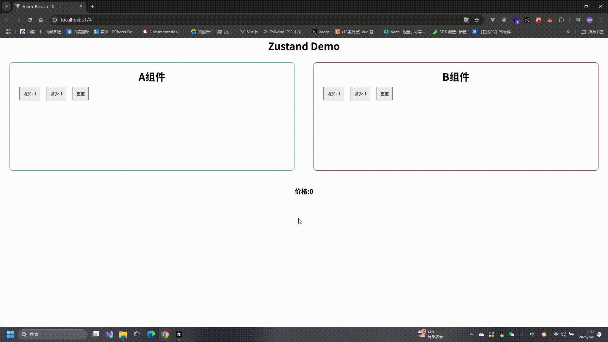

# Zustand 


Zustand是德语单词，意思是“状态”。中文空耳 `猝死丹特`,基本上每一个框架都会有自己的状态管理工具，比如 Vue 的 `Vuex`，React 的 `Redux`，Zustand 自然也是一个状态管理工具。

那么对比Redux，等状态管理工具Zustand 有什么优势呢？

>redux 是老牌状态管理库，能完成各种基本功能，并且有着庞大的中间件生态来扩展额外功能,但 redux 经常被人诟病它的使用繁琐。

1. `轻量级` Zustand 的体积非常小，只有 1kb 左右。
2. `简单易用` Zustand 不需要像Redux，去通过`Provider`包裹组件，Zustand提供了简洁的API，能够快速上手。
3. `易于集成` Zustand 可以轻松的与React 和 Vue 等框架集成。(Zustand也有Vue版本)
4. `扩拓展性` Zustand 提供了中间件的概念，可以通过插件的方式扩展功能，例如(持久化,异步操作，日志记录)等。
5. `无副作用` Zustand 推荐使用 `immer`库处理不可变性， 避免不必要的副作用。


## 安装


```bash
npm install zustand
```

- 案例比如说我们想全局管理一个金额，因为在我实际工作中就遇到到这种问题，一个金额涉及多个组件传来传去的，后来也改成了使用状态管理工具管理，非常不错。

获取本章代码 https://github.com/message163/react-course/tree/zustand 分支 `zustand`

1. 创建一个store文件夹在文件下下面创建对应的业务模块比如全局管理price.ts

```ts
import { create } from "zustand";
// 定义一个接口，用于描述状态管理器的状态和操作
interface PriceStore {
    price: number;
    incrementPrice: () => void;
    decrementPrice: () => void;
    resetPrice: () => void;
    getPrice: () => number;
}
// 创建一个状态管理器，使用 create 函数，传入一个函数，返回一个对象
/**
 * 
 * @param set 用于更新状态
 * @param get 用于获取状态
 * @returns 返回一个对象，对象中的方法可以用于更新状态
 */
const usePriceStore = create<PriceStore>((set, get) => ({
    price: 0, // 初始状态
    incrementPrice: () => set((state) => ({ price: state.price + 1 })), // 更新状态
    decrementPrice: () => set((state) => ({ price: state.price - 1 })), // 更新状态
    resetPrice: () => set({ price: 0 }), // 重置状态
    getPrice: () => get().price, // 获取状态
}));

export default usePriceStore;
```

- 在组件中使用

```tsx
import usePriceStore from './store/price';
export const App = () => {  
    //直接解构使用即可 把他当做一个hook使用
    const { price, incrementPrice, decrementPrice, resetPrice, getPrice } = usePriceStore();
    return (
        <div>
            <p>价格: {price}</p>
            <button onClick={incrementPrice}>增加</button>
            <button onClick={decrementPrice}>减少</button>
            <button onClick={resetPrice}>重置</button>
            <button onClick={getPrice}>获取</button>
        </div>
    )
}
```

:::tip
zustand的set函数会帮我们合并第一层状态，回想一下`useState`

```ts
import { useState } from 'react'

const [state, setState] = useState({
     name: '张三',
     age: 18,
     price: 0,
})

setState((state) => ({
    ...state, // 合并第一层状态 这个操作在zustand中会自动完成所以我们就不需要写这行代码了
    price: state.price + 1, // 更新状态
}))
```
:::


效果展示


